# Data Analysis with Python Ⅳ - Matplotlib

## Ⅰ. Introduction

> - Matplotlib 소개 및 기본 그래프
> - Graph : Scatter, Bar, Histogram

## Ⅱ. Get Started

```python
import matplotlib.pyplot as plt
```

파이썬에서 데이터를 그래프나 차트로 시각화할 수 있는 라이브러리이다. 다양한 형태의 그래프를 제공한다.

### 1. 기본적인 그래프 그려보기

```python
import matplotlib.pyplot as plt

x = [1, 2, 3, 4, 5]
y = [1, 2, 3, 4, 5]
plt.plot(x, y)
plt.title('First Plot')
plt.xlabel('x')
plt.ylabel('y')

plt.show()
```

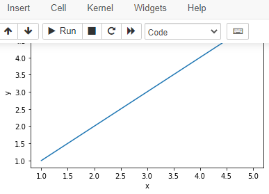

### 2. 저장하기

```python
import matplotlib.pyplot as plt

x = [1, 2, 3, 4, 5]
y = [1, 2, 3, 4, 5]
fig, ax = plt.subplots()
ax.plot(x, y)
ax.set_title("First Plot")
ax.set_xlabel("x")
ax.set_ylabel("y")

# plt.show()

fig.set_dip(300)
fig.savefig('first_plot.png')
```

### 3. 여러 그래프 그리기

```python
import matplotlib.pyplot as plt

x = np.linspace(0, np.pi*4, 100)
fig, axes = plt.subplots(2, 1)
axes[0].plot(x, np.sin(x))
axes[1].plot(x, np.cos(x))

plt.show()
```

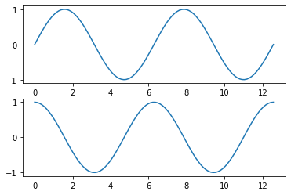

## Ⅲ. Matplotlib 그래프

### 1. Line plot

```python
import matplotlib.pyplot as plt

fig, ax = plt.subplots()
x = np.arange(15)
y = x ** 2
ax.plot(
    x, y,
    linestyle=":",
    marker="*",
    color="#524FA1"
)

plt.show()
```

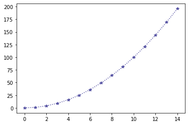

### 2. linestyle

```python
import matplotlib.pyplot as plt

x = np.arange(10)
fig, ax = plt.subplots()

ax.plot(x, x, linestyle="-") # solid
ax.plot(x, x+2, linestyle="--") # dashed
ax.plot(x, x+4, linestyle="-.") # dashdot
ax.plot(x, x+6, linestyle=":") # dotted

plt.show()
```

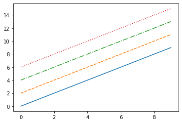

### 3. color

```python
import matplotlib.pyplot as plt

x = np.arange(10)
fig, ax = plt.subplots()

ax.plot(x, x, color="r")
ax.plot(x, x+2, color="green")
ax.plot(x, x+4, color='0.8')
ax.plot(x, x+6, color="#524FA1")

plt.show()
```

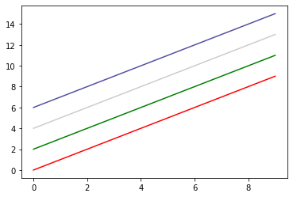

### 4. marker

```python
import matplotlib.pyplot as plt

x = np.arange(10)
fig, ax = plt.subplots()
ax.plot(x, x, marker=".")

ax.plot(x, x+2, marker="o")
ax.plot(x, x+4, marker='v')
ax.plot(x, x+6, marker="s")
ax.plot(x, x+8, marker="*")

plt.show()
```

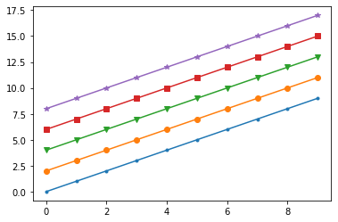

### 5. 축 경계 조정 : xlim / ylim

```python
import matplotlib.pyplot as plt

x = np.linspace(0, 10, 1000)
fig, ax = plt.subplots()
ax.plot(x, np.sin(x))
ax.set_xlim(-2, 12)
ax.set_ylim(-1.5, 1.5)

plt.show()
```

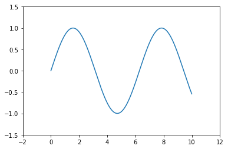

### 6. 범례 : legend

```python
import matplotlib.pyplot as plt

fig, ax = plt.subplots()
ax.plot(x, x, label='y=x')
ax.plot(x, x**2, label='y=x^2')
ax.set_xlabel("x")
ax.set_ylabel("y")
ax.legend(
    loc='upper right',
    shadow=True,
    fancybox=True,
    borderpad=2
)

plt.show()
```

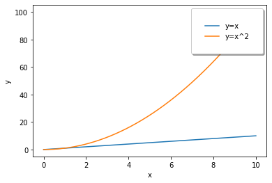

## Ⅳ. 다양한 그래프

### 1. Scatter

```python
import matplotlib.pyplot as plt

fig, ax = plt.subplots()
x = np.arange(10)
ax.plot(
    x, x**2, "o",
    markersize=15,
    markerfacecolor='white',
    markeredgecolor="blue"
)

plt.show()
```

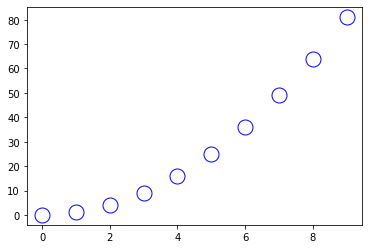

### 2. bar

```python
import matplotlib.pyplot as plt

import matplotlib.pyplot as plt

x = np.arange(10)
fig, ax = plt.subplots(figsize=(12, 4))
ax.bar(x, x*2)

plt.show()
```

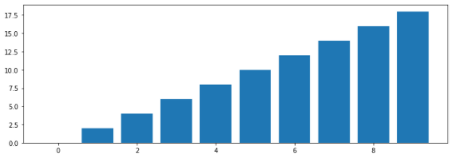

### 3. histogram

```python
import matplotlib.pyplot as plt

fig, ax = plt.subplots()
data = np.random.randn(1000)
ax.hist(data, bins=100)

plt.show()
```

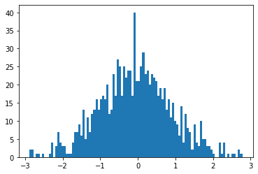
